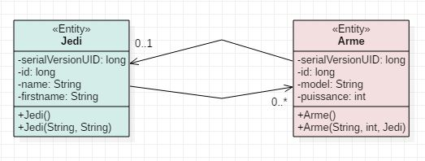
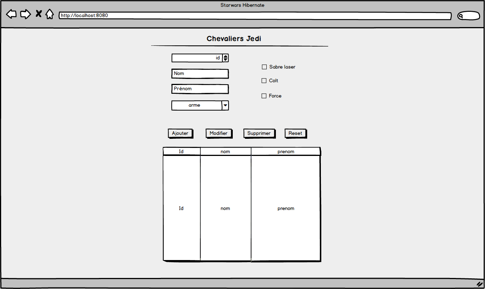

# eval-session3
Evaluation Hibernate JPA de Laurent et Cédric

Application Web qui affiche un tableau de Jedi.

4 boutons : 
Ajouter un nouveau Jedi avec des armes (grace au formulaire)
Modifier un Jedi existant grace à son Id 
Supprimer un Jedi existant
Reset du formulaire

Un double click sur un Jedi dans le tableau affiche ses caractéristiques dans le formulaire.

# UML

# Maquette

